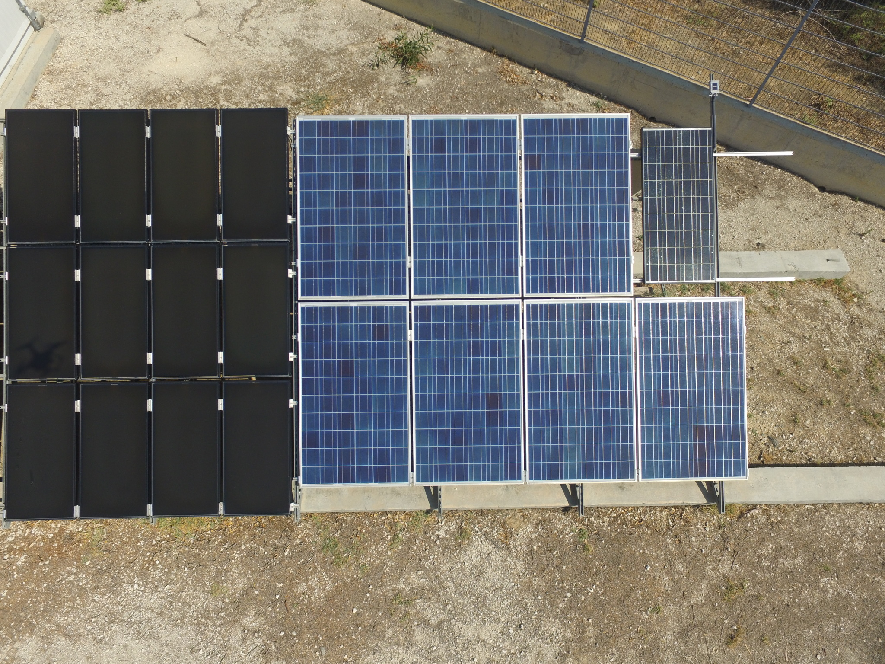
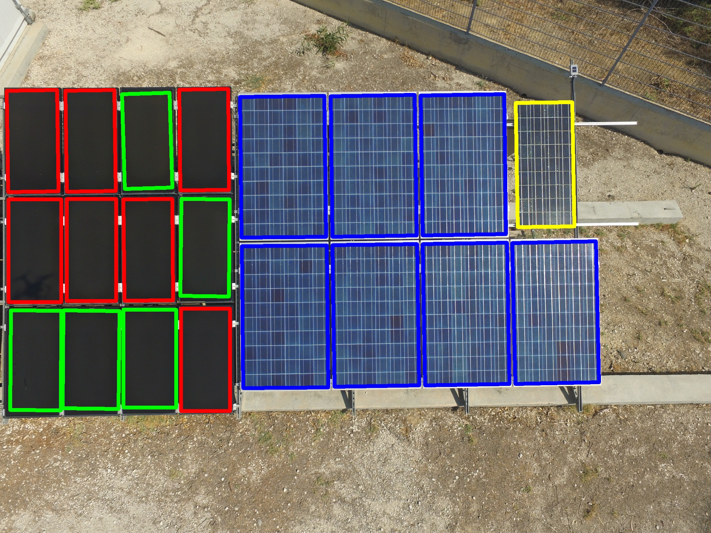
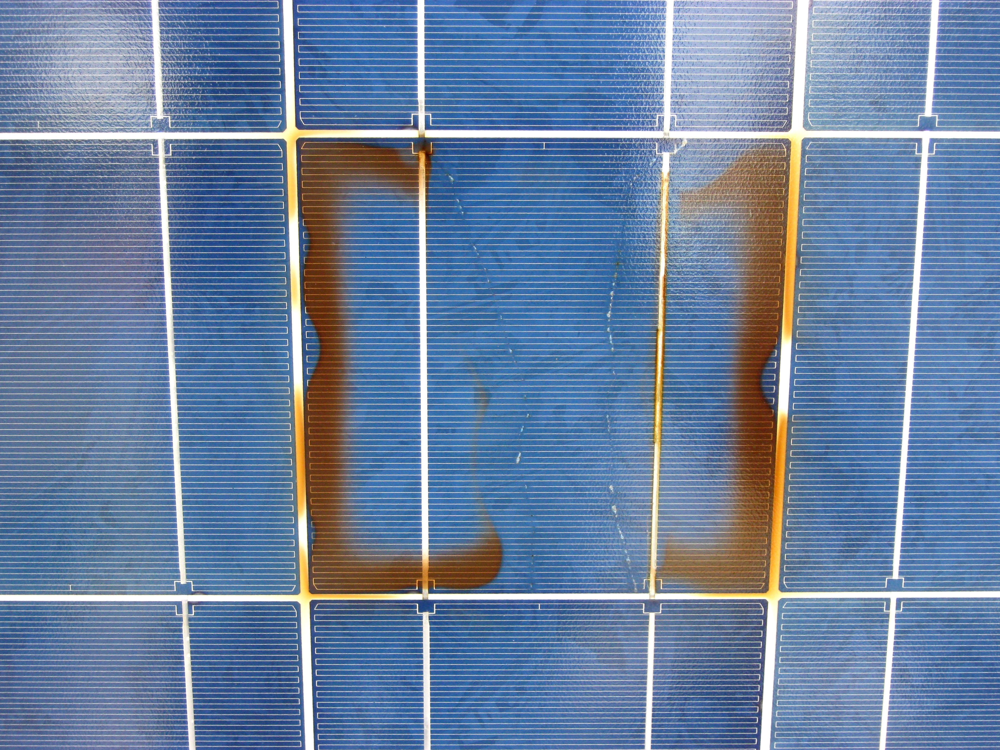

# SolarPanels
This is a project for Solar Panels recognition in pictures taken from drones.
It is consisted of 2 parts:
- CloseDetect.py detects solar panels 
- Failure.py detects burned parts on a solar panel

#### CloseDetect.py Results

#### Failure.py Results

## Prerequisites
To use it you must install OpenCV for python.
[Here](https://www.pyimagesearch.com/2016/10/24/ubuntu-16-04-how-to-install-opencv/) is a guide to install it.

## Running 
python CloseDetect.py -f [path to picture taken from drone to find solar panels]

python Failure.py -b [path to picture with solar panel with burned part]